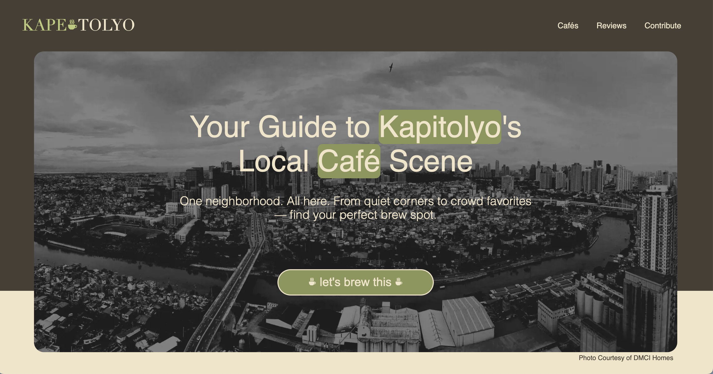
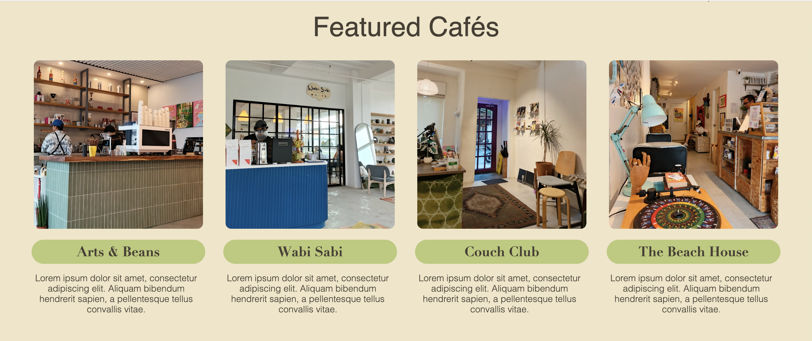
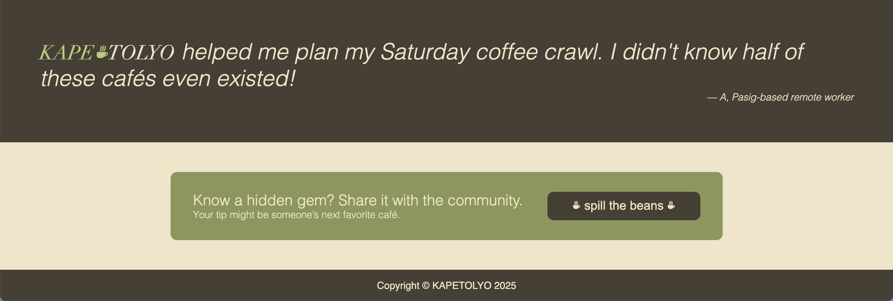

# KAPETOLYO: Landing Page

## Overview

This is a static landing page project built with basic **HTML** and **CSS** as part of [The Odin Project – Foundations Course](https://www.theodinproject.com/lessons/foundations-landing-page). It serves as a practice exercise to apply semantic HTML, CSS styling, and basic layout techniques using Flexbox.

## Concept

**KAPETOLYO** is a fictional platform designed to showcase independent coffee shops located in Barangay Kapitolyo, Pasig City — a well-known hub for local cafés and creative spaces.

## Image Preview

## Live Demo

View the landing page live [here](https://charmbun.github.io/rock-paper-scissors/).

## License

This project is for educational purposes only.
All referenced names, logos, and café identities are used for non-commercial  purposes.
